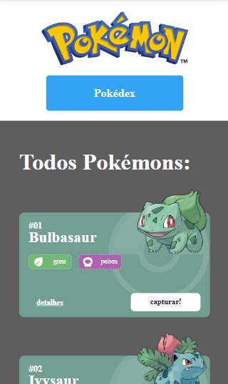
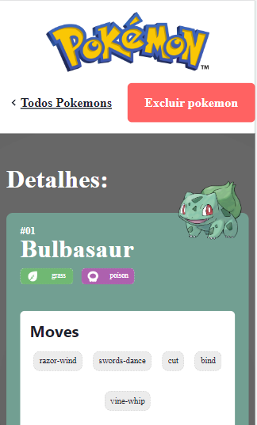
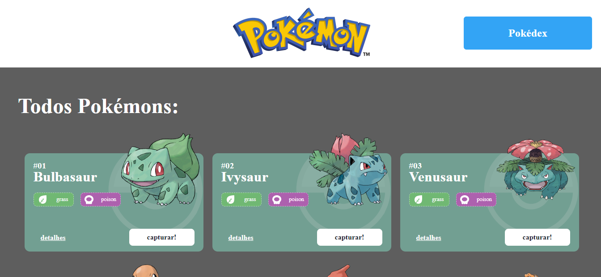
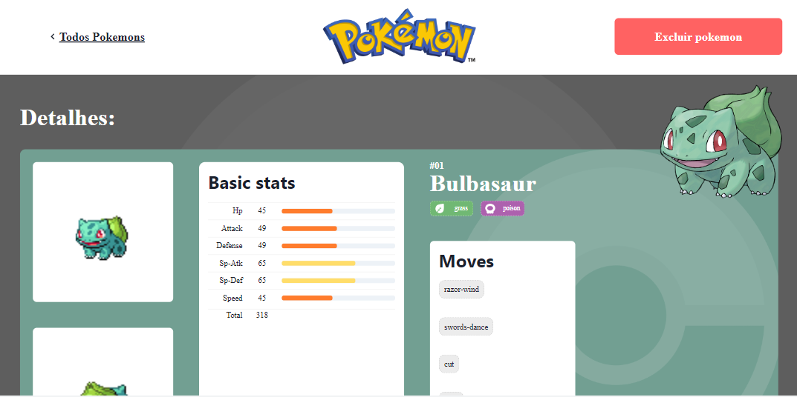

# **Projeto React e API's**

## 📖 Introdução 

O Projeto React e APIs é um site de pokémons que possui três páginas: Home, Pokedex e Detalhes. O projeto está subdivido em temas de acordo com os conteúdos que estudado durante o Módulo 2 - Frontend.

Este projeto terá como fonte de dados para a sua criação a [Poke Api](https://pokeapi.co/ "Poke Api"), uma Api pública, muito usada para aplicações focadas em aprendizado de programação e também usada em cases de processos seletivos.

Os conteúdos principais  a serem estudados são:

- Integração de APIs
- React Router
- Design Systems
- Estado Global

## 🔗Link de Acesso
- Deploy Surge: [clique aqui!](https://react-api-pokedex.surge.sh/).

## 📄Concepção do Projeto

### Instalando
```bash
# Instalando dependências
npm install

# executando o projeto
npm start
```

### Layout Mobile

| <br><sub>Home Page</sub> | <br><sub>Detalhes</sub> |
| :---: | :---: |

### Layout Desktop

| <sub>Home Page</sub><br> | <br><sub>Detalhes</sub><br>
| :---: | :---: |


### Funcionalidades
```bash
. Listagem: Listagem de todos os 1008 pokemons existentes, organizados por página (20 em cada);
. Detalhes: Cada card exibirá informações detalhadas como Base Stats 
(estatisticas) e Movimentos ao ser clicado;
. Captura: Adicionar pokemons a sua Pokedex pessoal;
. Responsividade: Aplicação totalmente responsiva para Desktop, Tablet e Celulares;
```

### Bibliotecas Utilizadas

```bash
axios
react-router-dom
@chakra-ui/react
@emotion/react
@emotion/styled
framer-motion
@chakra-ui/icons
react-icons
@fontsource/inter
@fontsource/poppins
```

## 💡Programas utilizados:
- VSCode

## 💻Tecnologias 


## 📫 Contato

 <a href = "mailto:italo.rocha.de.oliveira@gmail.com"></a>
  <a href="https://www.linkedin.com/in/italorochaoliveira/" target="_blank"></a>
